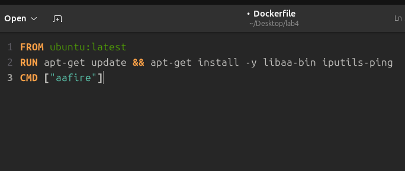
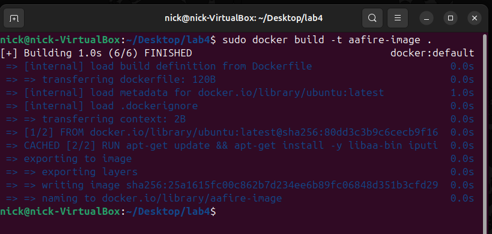
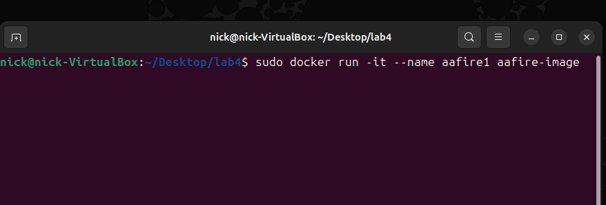
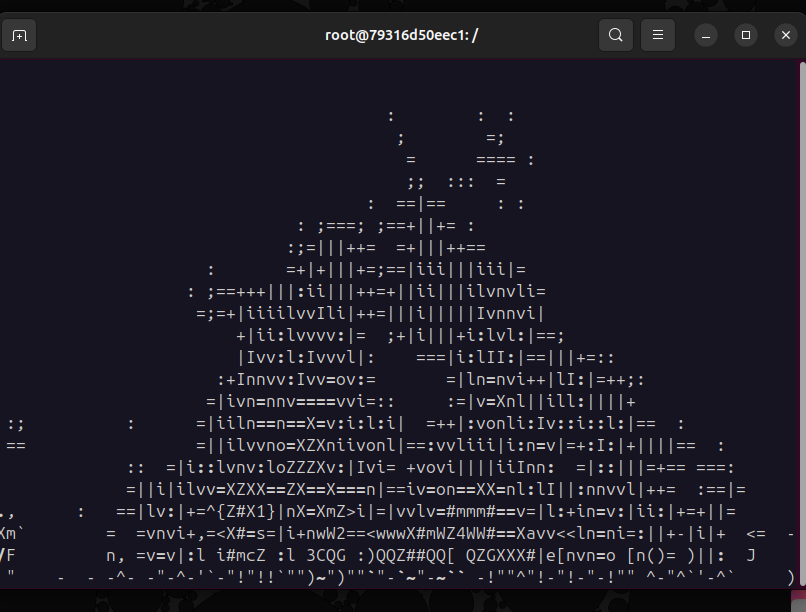
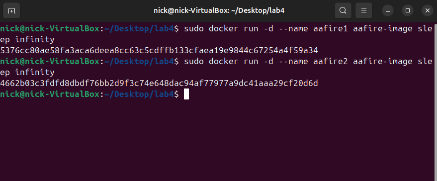
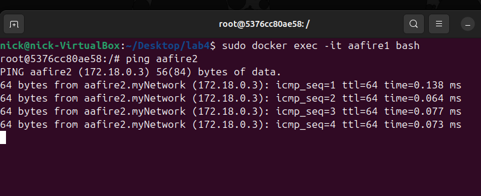
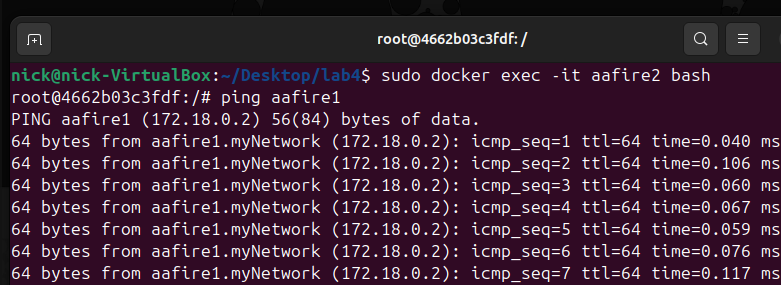

# Отчет по лабораторной работе 3
*Выполнил __Малыхин Никита Сергеевич__* 

## Цель
Запустить в контейнере приложение “aafire”. Обратите внимание, что оно бесконечное и контейнер не будет автоматически отключаться.
Приложить скриншот в процессе работы контейнера.

Далее в рамках лабораторной работы необходимо самостоятельно настроить сеть между двумя контейнерами, также как в предыдущей работе вы настраивали связь между двумя виртуальными машинами.

## Создание образа

### 1. Создаем Dockerfile со следующим содержимом:


### 2. Строим образ "aafire-image":
```
sudo docker build -t aafire-image .
```


### 3. Запускаем контейнер на основе образа:
```
sudo docker run -it --name aafire1 aafire-image
```


### 4. Результат:



## Настройка сети между двумя контейнерами

### 1. Удалим предыдущий контейнер:
```
sudo docker stop aafire1
sudo docker rm aafire1
```

### 2. Создадим два новых контейнера, дописав sleep infinity, чтобы контейнер не останавливал свой процесс:
```
sudo docker run -d --name aafire1 aafire-image sleep infinity
sudo docker run -d --name aafire2 aafire-image sleep infinity
```



### 3. Создим сеть "myNetwork" и подключаем к ней контейнеры:
```
sudo docker network create myNetwork
sudo docker network connect myNetwork aafire1
sudo docker network connect myNetwork aafire2
```


### 4. Проверяем ping для каждого контейнера:




## Вывод

Было создано и настроено два контейнера aafire1 и aafire2, которые были добавлены в одну сеть, а также проверена связь между контейнерами командой ping.